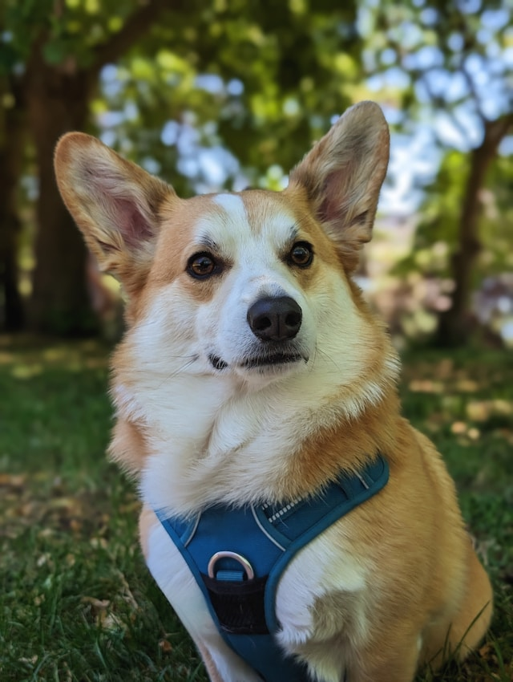
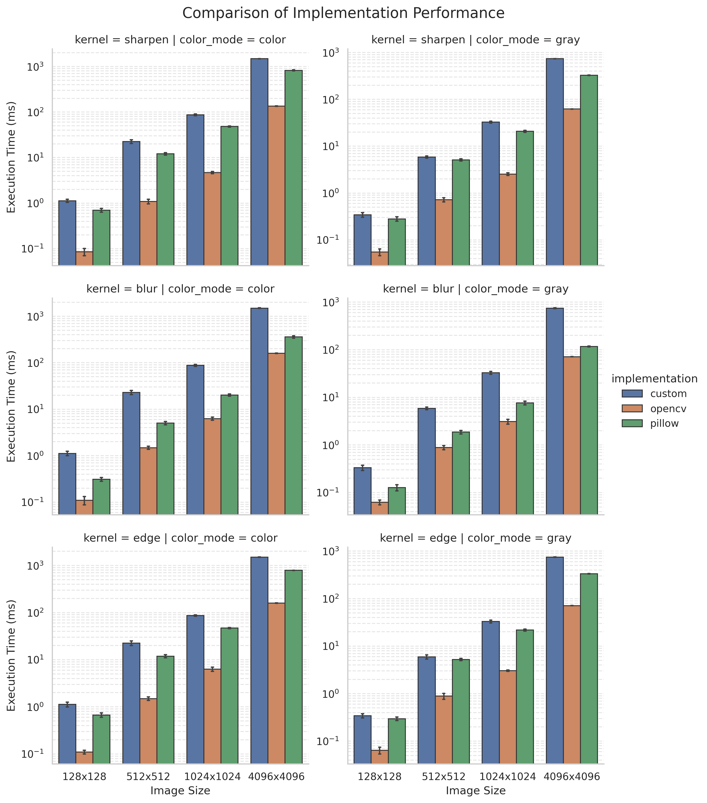

# Image Convolution

### Учебный проект по реализации операции свёртки изображений на Python.



### Бэнчмарки

#### Запуск
```python
uv run pytest test_benchmark.py --benchmark-columns=min,max,mean,stddev --benchmark-sort=mean --benchmark-json=result.json 
```
Для отрисовки
```
uv run visualisation.py
```

Все изображения были взяты с `unplash.com`, распространяются под свободной лицензией.

